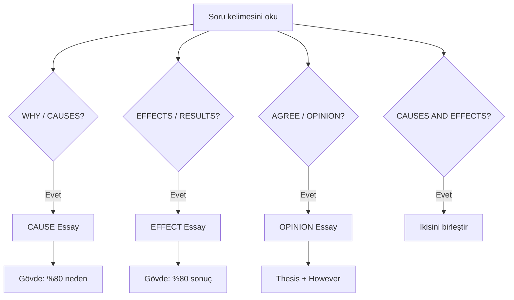

# 📚 B1+ Professional Writing Masterpack

### Cause · Effect · Opinion · Cause & Effect Combined

**Sınav odaklı · Cümle cümle Türkçe · Kelime tabloları · Renkli trick kutuları**

[🇹🇷 Türkçe rehber](#-i̇çindekiler) · [Essay örnekleri](#-örnek-essay-haritası) · [Kelime bankası](#-mega-kelime-bankası-150-kelime) · [Sınav günü](#-sınav-günü-zaman-çizelgesi)

📄 **PDF indir:** [B1-Plus-Writing-Masterpack.pdf](./B1-Plus-Writing-Masterpack.pdf) · Yerel üretim: `npm run build:pdf`

---

## 🎨 Bu dokümanda renkler ne anlama geliyor?

| Simge / Kutu | Anlam | Ne zaman bak? |
|:---:|:---|:---|
| 🟦 `TIP` | Puan kazandıran trick | Yazmadan önce |
| 🟨 `IMPORTANT` | Thesis / zorunlu yapı | Her essay türünde |
| 🟥 `WARNING` | Sık hata — puan kaybı | Kontrol listesinde |
| 🟩 `NOTE` | Kelime / gramer notu | Kelime çalışırken |
| 🟪 `CAUTION` | Cause ↔ Effect karışıklığı | Konu seçerken |
| 📊 Tablo | Essay cümle + Türkçe | Ezber ve taklit |
| 📦 `
` | Uzun essay — tıkla aç | Derin çalışma |

> [!TIP]
> **En hızlı sınav trick’i:** İlk 3 dakikada soruya şunu yaz: *Cause = WHY · Effect = SO WHAT · Opinion = I BELIEVE*

---

## 📑 İçindekiler

| # | Bölüm |
|---|--------|
| 0 | [Hızlı karar ağacı](#-hızlı-karar-ağacı-hangi-essay) |
| 1 | [Altın yapı & PEEL](#1--altın-yapı--peel-formülü) |
| 2 | [Bağlaç & kalıp sözlüğü](#2--bağlaç--kalıp-sözlüğü-60-ifade) |
| 3 | [Cause Essay ×2](#3--cause-essay-neden-odaklı) |
| 4 | [Effect Essay ×2](#4--effect-essay-sonuç-odaklı) |
| 5 | [Opinion Essay ×2](#5--opinion-essay-görüş-odaklı) |
| 6 | [Cause & Effect birlikte](#6--cause--effect-birlikte) |
| 7 | [Mega kelime bankası](#-mega-kelime-bankası-150-kelime) |
| 8 | [Formal ↔ informal](#8--formal--informal-dönüşüm) |
| 9 | [Puan rubriği](#9--sınav-puan-rubriği-öğretmen-gözüyle) |
| 10 | [Sınav günü planı](#-sınav-günü-zaman-çizelgesi) |
| 11 | [20 alıştırma konusu](#11--20-alıştırma-konusu) |

---

## 🗺️ Örnek essay haritası

| Tür | Konu | Kelime | Tablo |
|-----|------|:------:|:-----:|
| **Cause #1** | Gençlerde obezite nedenleri | ~265 | [Aç](#cause-essay-1--obezite) |
| **Cause #2** | Genç işsizlik nedenleri | ~270 | [Aç](#cause-essay-2--genç-i̇şsizlik) |
| **Effect #1** | Büyük şehirlerde hava kirliliği etkileri | ~258 | [Aç](#effect-essay-1--hava-kirliliği) |
| **Effect #2** | Aşırı sosyal medya etkileri | ~275 | [Aç](#effect-essay-2--sosyal-medya) |
| **Opinion #1** | Üniversite ücretsiz mi? | ~272 | [Aç](#opinion-essay-1--ücretsiz-üniversite) |
| **Opinion #2** | Okul ödevleri yasaklanmalı mı? | ~268 | [Aç](#opinion-essay-2--ödev-yasağı) |

---

## 🔀 Hızlı karar ağacı: Hangi essay?

> [!CAUTION]
> **Cause essay’de** uzun sonuç listesi yazma. **Effect essay’de** uzun neden listesi yazma. Sınavcı hangi beceriyi ölçtüğünü anlar.

---

# 1 · Altın yapı & PEEL formülü

> [!IMPORTANT]
> **Thesis kuralı:** Ana görüş cümlesi giriş paragrafının **son cümlesi** olmalı. Örnek: *This essay will discuss three main causes: A, B and C.*

| Bölüm | Süre (40 dk sınav) | Görev |
|--------|:------------------:|-------|
| 📝 Plan | 5 dk | 3 madde + 3 örnek |
| 🟢 Introduction | 5 dk | Hook + background + **thesis** |
| 🔵 Body ×3 | 22 dk | PEEL ×3 |
| 🟣 Conclusion | 5 dk | Özet + öneri (yeni fikir yok) |
| ✅ Kontrol | 3 dk | Bağlaç, affect/effect, kelime sayısı |

### PEEL — her body paragrafı

| Harf | İngilizce | Türkçe | Örnek başlangıç |
|:---:|-----------|--------|-----------------|
| **P** | Point | Ana fikir | *One main cause is…* |
| **E** | Explain | Açıkla | *This means that…* |
| **E** | Example | Örnek | *For instance, …* |
| **L** | Link | Bağla | *Therefore, … / This shows that…* |

> [!TIP]
> **Trick:** Her body paragrafına **en az bir** *For example* veya *For instance* koy. Olmadan B1+ paragraf “zayıf” sayılır.

---

# 2 · Bağlaç & kalıp sözlüğü (60+ ifade)

## 🟦 Giriş kalıpları

| Kalıp | Türkçe | Essay |
|-------|--------|-------|
| *Nowadays, … has become a serious issue.* | Günümüzde … ciddi bir sorun haline geldi. | Hepsi |
| *It is widely accepted that…* | Yaygın olarak kabul edilir ki… | Opinion |
| *There is no doubt that…* | Şüphesiz ki… | Hepsi |
| *This essay will examine / discuss…* | Bu yazı … inceleyecek / ele alacak. | Cause/Effect |
| *In recent years, … has increased dramatically.* | Son yıllarda … önemli ölçüde arttı. | Cause/Effect |

## 🟩 Sıralama & ekleme

| Kalıp | Türkçe |
|-------|--------|
| *First of all / Firstly* | Öncelikle |
| *Secondly / In the second place* | İkinci olarak |
| *Furthermore / Moreover / In addition* | Ayrıca, dahası |
| *Another significant factor is…* | Bir diğer önemli faktör … |
| *Last but not least* | Son ama en az önemli olmayan |
| *Finally* | Son olarak |

## 🟨 Sebep (Cause)

| Kalıp | Türkçe |
|-------|--------|
| *One of the main causes is…* | Ana nedenlerden biri … |
| *This is mainly because…* | Bu esas olarak şundan dolayı |
| *Due to / Owing to* | -den dolayı |
| *As a result of* | … sonucu olarak |
| *This happens when…* | Bu … olduğunda olur |
| *… is caused by…* | … tarafından neden olunur |
| *A key reason why…* | … olmasının temel nedeni |

## 🟧 Sonuç (Effect)

| Kalıp | Türkçe |
|-------|--------|
| *As a result / Therefore* | Sonuç olarak |
| *Consequently / Hence* | Bu nedenle |
| *This can lead to…* | Bu …-a yol açabilir |
| *… has a negative/positive impact on…* | … üzerinde olumsuz/olumlu etkisi var |
| *One effect is…* | Bir etkisi … |
| *This results in…* | Bu … ile sonuçlanır |

## 🟪 Görüş (Opinion)

| Kalıp | Türkçe |
|-------|--------|
| *In my opinion / view* | Bence |
| *I strongly believe that…* | Kesinlikle inanıyorum ki… |
| *From my point of view* | Benim bakış açımdan |
| *I am convinced that…* | … konusunda ikna oldum |
| *Some people argue… However, …* | Bazıları savunur… Ancak… |
| *On the one hand… On the other hand…* | Bir yandan… Diğer yandan… |
| *I fully support / oppose* | Tamamen destekliyorum / karşıyım |

## 🟥 Sonuç kalıpları

| Kalıp | Türkçe |
|-------|--------|
| *To sum up / In conclusion* | Özetle / Sonuç olarak |
| *All in all* | Genel olarak |
| *Taking everything into account* | Her şeyi göz önüne alınca |
| *On balance, …* | Dengeli bir değerlendirmeyle… |

> [!WARNING]
> **Sonuçta yeni argüman ekleme.** Sadece özetle + (isteğe bağlı) tek cümle öneri.

---

# 3 · CAUSE Essay (neden odaklı)

 

| Soru anahtar kelimeleri | Yaz |
|-------------------------|-----|
| *Why…? · What causes…? · Reasons for…* | Neden listesi |

**Thesis şablonu:**
> *There are several reasons why [topic]. This essay will discuss three main causes: [A], [B] and [C].*

---

## Cause Essay #1 — Obezite

**Soru:** *What are the causes of obesity among young people?* · **~265 kelime**

<b>📊 Tıkla — Cümle cümle İngilizce + Türkçe tablo (19 satır)</b>

| # | English | Türkçe |
|---|---------|--------|
| 1 | Nowadays, obesity among young people has become a serious public health problem in many countries. | Günümüzde gençler arasında obezite birçok ülkede ciddi bir halk sağlığı sorunudur. |
| 2 | Doctors and teachers are worried because this issue can lead to diabetes, heart disease and low self-confidence. | Doktorlar ve öğretmenler endişeli; bu sorun diyabet, kalp hastalığı ve düşük özgüvene yol açabilir. |
| 3 | Although genetics can play a role, I believe lifestyle and environment are the main causes. | Genetik rol oynasa da yaşam tarzı ve çevre ana nedenlerdir. |
| 4 | This essay will discuss three causes: unhealthy diet, lack of activity and heavy advertising. | Bu yazı üç nedeni ele alır: sağlıksız beslenme, hareketsizlik, yoğun reklam. |
| 5 | First, many teenagers eat too much fast food, sugary drinks and processed snacks. | Önce birçok genç çok fazla fast food ve şekerli içecek tüketir. |
| 6 | These products are cheap, tasty and easy to buy after school. | Bu ürünler ucuz, lezzetli ve okul sonrası alınması kolaydır. |
| 7 | As a result, they consume more calories than they need. | Sonuç olarak ihtiyaçlarından fazla kalori alırlar. |
| 8 | For instance, daily large sodas can add hundreds of extra calories weekly. | Örneğin günlük büyük gazlı içecekler haftalık yüzlerce fazla kalori ekler. |
| 9 | Secondly, teenagers spend a great deal of time in front of screens. | İkinci olarak gençler ekran başında çok zaman harcar. |
| 10 | They watch videos and play games for hours after homework. | Ödevden sonra saatlerce video izler ve oyun oynarlar. |
| 11 | Consequently, they move less than previous generations. | Bu nedenle önceki nesillere göre daha az hareket ederler. |
| 12 | Parents also fear letting children play outside alone. | Ebeveynler çocuğun dışarıda yalnız oynamasından korkar. |
| 13 | Furthermore, companies target youth with ads on social media. | Ayrıca şirketler sosyal medyada gençleri reklamlarla hedefler. |
| 14 | Influencers promote unhealthy products without clear warnings. | Fenomenler riski açıklamadan sağlıksız ürün tanıtır. |
| 15 | Due to marketing, sugary products seem "cool" and normal. | Pazarlama yüzünden şekerli ürünler "havalı" görünür. |
| 16 | Families find it harder to serve balanced meals. | Aileler dengeli yemek sunmakta zorlanır. |
| 17 | To sum up, obesity is caused by poor diet, inactivity and advertising. | Özetle obezite kötü beslenme, hareketsizlik ve reklamdan kaynaklanır. |
| 18 | Schools and governments should act early. | Okullar ve hükümetler erken hareket etmelidir. |
| 19 | The next generation deserves a healthier future. | Gelecek nesil daha sağlıklı bir geleceği hak eder. |

### Cause #1 — Kelime tablosu (25 kelime)

| Kelime | Türkçe | Örnek |
|--------|--------|-------|
| obesity | obezite | *Childhood obesity is rising.* |
| public health | halk sağlığı | *Public health campaigns help citizens.* |
| lead to | yol açmak | *Smoking can lead to cancer.* |
| diabetes | diyabet | *Diabetes needs medical care.* |
| genetics | genetik | *Genetics influence height.* |
| lifestyle | yaşam tarzı | *A sedentary lifestyle is risky.* |
| processed | işlenmiş | *Processed meat contains additives.* |
| consume | tüketmek | *We consume too much sugar.* |
| calorie | kalori | *One banana has few calories.* |
| fibre | lif | *Fibre improves digestion.* |
| consequently | sonuç olarak | *It rained; consequently, we stayed in.* |
| generation | nesil | *Each generation faces new problems.* |
| target (v.) | hedeflemek | *Ads target teenagers.* |
| influencer | fenomen | *The influencer sold a drink.* |
| promote | tanıtmak | *They promote eco products.* |
| psychological | psikolojik | *Stress has psychological effects.* |
| balanced | dengeli | *Eat a balanced diet.* |
| regulate | düzenlemek | *Laws regulate tobacco ads.* |
| aggressive | agresif, yoğun | *Aggressive marketing affects children.* |
| inactivity | hareketsizlik | *Inactivity weakens muscles.* |
| sedentary | hareketsiz oturan | *Office work is sedentary.* |
| affordable | uygun fiyatlı | *Fast food seems affordable.* |
| nutritious | besleyici | *Vegetables are nutritious.* |
| habit | alışkanlık | *Reading is a good habit.* |
| take action | harekete geçmek | *We must take action now.* |

---

## Cause Essay #2 — Genç işsizlik

**Soru:** *What are the causes of youth unemployment?* · **~270 kelime**

<b>📊 Tıkla — Cümle cümle tablo (20 satır)</b>

| # | English | Türkçe |
|---|---------|--------|
| 1 | Youth unemployment is a growing problem in both developed and developing countries. | Genç işsizlik hem gelişmiş hem gelişmekte olan ülkelerde büyüyen bir sorundur. |
| 2 | When young people cannot find work, they may lose motivation and depend on their families. | Gençler iş bulamayınca motivasyon kaybeder ve ailelerine bağımlı kalabilir. |
| 3 | This essay will analyse three major causes: lack of experience, economic crisis and skills mismatch. | Bu yazı üç ana nedeni analiz eder: deneyim eksikliği, ekonomik kriz, beceri uyumsuzluğu. |
| 4 | First of all, many employers prefer workers with several years of experience. | Öncelikle birçok işveren birkaç yıl deneyimi olan çalışanları tercih eder. |
| 5 | Graduates often hear that they are "overqualified" or "too inexperienced" at the same time. | Mezunlar hem "fazla nitelikli" hem "deneyimsiz" olduklarını duyar. |
| 6 | As a result, they cannot enter the labour market even with a university degree. | Sonuç olarak üniversite diplomasıyla bile iş gücüne giremezler. |
| 7 | For example, a biology graduate may fail to get a lab job without internships. | Örneğin biyoloji mezunu staj olmadan laboratuvar işi alamayabilir. |
| 8 | Secondly, economic downturns reduce the number of available jobs. | İkinci olarak ekonomik durgunluklar mevcut iş sayısını azaltır. |
| 9 | During a recession, companies close branches and freeze hiring. | Resesyon sırasında şirketler şube kapatır, işe alımı dondurur. |
| 10 | Consequently, competition becomes fierce among thousands of applicants. | Bu nedenle binlerce başvuru sahibi arasında rekabet şiddetlenir. |
| 11 | Young workers are often the first to be laid off because they have short contracts. | Gençler genelde kısa sözleşmeli oldukları için ilk işten çıkarılanlardır. |
| 12 | Thirdly, there is a mismatch between what schools teach and what industry needs. | Üçüncü olarak okulların öğrettiği ile sanayinin ihtiyacı uyuşmaz. |
| 13 | Many programmes focus on theory, while employers want digital and communication skills. | Birçok program teoriye odaklanır; işverenler dijital ve iletişim becerisi ister. |
| 14 | Due to outdated curricula, students are unprepared for modern workplaces. | Güncel olmayan müfredat yüzünden öğrenciler modern işyerine hazırsızdır. |
| 15 | In some regions, young people also lack affordable transport to industrial zones. | Bazı bölgelerde gençlerin sanayi bölgelerine uygun ulaşımı da yoktur. |
| 16 | This geographical barrier limits their chances further. | Bu coğrafi engel şanslarını daha da kısar. |
| 17 | To conclude, youth unemployment stems from inexperience, weak economies and poor training. | Sonuç olarak genç işsizlik deneyimsizlik, zayıf ekonomi ve kötü eğitimden kaynaklanır. |
| 18 | Governments should fund internships and update vocational education. | Hükümetler staj fonlamalı ve meslek eğitimini güncellemelidir. |
| 19 | Companies must invest in training young talent. | Şirketler genç yeteneğe yatırım yapmalıdır. |
| 20 | Solving this issue early protects social stability. | Bu sorunu erken çözmek toplumsal istikrarı korur. |

### Cause #2 — Kelime tablosu (22 kelime)

| Kelime | Türkçe | Örnek |
|--------|--------|-------|
| unemployment | işsizlik | *Unemployment rose last year.* |
| developed | gelişmiş | *Developed countries invest in tech.* |
| motivation | motivasyon | *Praise increases motivation.* |
| analyse / analyze | analiz etmek | *We analyse the data carefully.* |
| lack of | eksiklik | *Lack of sleep affects mood.* |
| employer | işveren | *The employer offers training.* |
| graduate | mezun | *She is a recent graduate.* |
| labour market | iş gücü piyasası | *The labour market is competitive.* |
| internship | staj | *I did a summer internship.* |
| economic downturn | ekonomik durgunluk | *Downturns hurt small firms.* |
| recession | resesyon | *During recession sales fall.* |
| freeze hiring | işe alımı dondurmak | *They froze hiring in 2020.* |
| fierce | şiddetli, yoğun | *Competition is fierce.* |
| applicant | başvuran | *There were 200 applicants.* |
| lay off | işten çıkarmak | *The factory laid off staff.* |
| mismatch | uyumsuzluk | *Skills mismatch slows hiring.* |
| curriculum | müfredat | *The curriculum needs updating.* |
| outdated | modası geçmiş | *Outdated rules cause problems.* |
| vocational | mesleki | *Vocational schools teach trades.* |
| geographical | coğrafi | *Geographical distance matters.* |
| barrier | engel | *Language can be a barrier.* |
| social stability | toplumsal istikrar | *Jobs support social stability.* |

---

# 4 · EFFECT Essay (sonuç odaklı)

 

**Thesis şablonu:**
> *[Topic] has serious effects on [X], [Y] and [Z]. This essay will examine these impacts.*

---

## Effect Essay #1 — Hava kirliliği

**Soru:** *What are the effects of air pollution in big cities?* · **~258 kelime**

<b>📊 Tıkla — Cümle cümle tablo (19 satır)</b>

| # | English | Türkçe |
|---|---------|--------|
| 1 | Air pollution is one of the most serious environmental problems in large cities. | Hava kirliliği büyük şehirlerin en ciddi çevre sorunlarından biridir. |
| 2 | It is caused by traffic, factories and fossil fuels. | Trafik, fabrika ve fosil yakıtlardan kaynaklanır. |
| 3 | The effects on health, economy and daily life are equally worrying. | Sağlık, ekonomi ve günlük yaşam etkileri aynı derecede endişe vericidir. |
| 4 | This essay will examine three major effects. | Bu yazı üç büyük etkiyi inceleyecektir. |
| 5 | One dangerous effect is on human health. | Tehlikeli bir etki insan sağlığıdır. |
| 6 | Fine particles enter the lungs and bloodstream. | İnce parçacıklar akciğer ve kan dolaşımına girer. |
| 7 | As a result, asthma and heart disease increase. | Sonuç olarak astım ve kalp hastalığı artar. |
| 8 | In megacities, schools sometimes close on high-pollution days. | Megakentlerde yüksek kirlilik günlerinde okullar kapanır. |
| 9 | Another effect is economic. | Bir diğer etki ekonomiktir. |
| 10 | Governments spend billions on treatment and sick leave. | Hükümetler tedavi ve hastalık iznine milyarlar harcar. |
| 11 | Tourism suffers when visitors see smog. | Ziyaretçiler sis dumanı görünce turizm zarar görür. |
| 12 | Hotels earn less during polluted seasons. | Oteller kirli mevsimde daha az kazanır. |
| 13 | Pollution also lowers everyday quality of life. | Kirlilik günlük yaşam kalitesini düşürür. |
| 14 | Residents wear masks and avoid outdoor sport. | Sakinler maske takar, açık hava sporundan kaçınır. |
| 15 | This can lead to stress and social isolation. | Bu stres ve yalnızlığa yol açabilir. |
| 16 | Dirty air damages historic buildings too. | Kirli hava tarihi yapılara da zarar verir. |
| 17 | In conclusion, pollution harms health, economy and urban life. | Sonuç olarak kirlilik sağlık, ekonomi ve kent yaşamına zarar verir. |
| 18 | Cities should invest in public transport and green zones. | Şehirler toplu taşıma ve yeşil alana yatırım yapmalı. |
| 19 | Future citizens deserve cleaner air. | Gelecek vatandaşlar daha temiz hava hak eder. |

### Effect #1 — Kelime tablosu (24 kelime)

| Kelime | Türkçe | Örnek |
|--------|--------|-------|
| environmental | çevresel | *Environmental damage is costly.* |
| fossil fuels | fosil yakıt | *We should reduce fossil fuels.* |
| fine particles | ince parçacık | *Particles come from exhaust.* |
| bloodstream | kan dolaşımı | *Toxins enter the bloodstream.* |
| asthma | astım | *Dust triggers asthma.* |
| megacity | megakent | *Shanghai is a megacity.* |
| economic growth | ekonomik büyüme | *Growth creates jobs.* |
| sick leave | hastalık izni | *He took sick leave.* |
| smog | sis dumanı | *Smog hid the skyline.* |
| tourism | turizm | *Tourism supports local jobs.* |
| resident | sakin | *Residents complained about noise.* |
| isolation | yalnızlık | *Isolation harms teenagers.* |
| historic | tarihi | *Historic walls turned black.* |
| invest in | yatırım yapmak | *They invested in solar power.* |
| green zones | yeşil alan | *Parks are green zones.* |
| harmful | zararlı | *Smoking is harmful.* |
| urban | kentsel | *Urban pollution is visible.* |
| exhaust | egzoz | *Car exhaust pollutes streets.* |
| renewable | yenilenebilir | *Renewable energy is cleaner.* |
| policy | politika | *New policies reduced waste.* |
| citizen | vatandaş | *Citizens demand clean water.* |
| infrastructure | altyapı | *Better infrastructure helps trade.* |
| emission | emisyon, salınım | *Emissions must fall by 2030.* |
| sustainable | sürdürülebilir | *Sustainable cities plant trees.* |

---

## Effect Essay #2 — Sosyal medya

**Soru:** *What are the effects of using social media too much?* · **~275 kelime**

<b>📊 Tıkla — Cümle cümle tablo (21 satır)</b>

| # | English | Türkçe |
|---|---------|--------|
| 1 | Social media platforms are now part of everyday life for billions of users. | Sosyal medya platformları milyarlarca kullanıcının günlük hayatının parçasıdır. |
| 2 | Although they help people stay connected, excessive use can damage health and relationships. | İnsanları bağlı tutsa da aşırı kullanım sağlık ve ilişkilere zarar verebilir. |
| 3 | This essay will explore three important effects: mental health problems, poor academic performance and sleep loss. | Bu yazı üç etkiyi inceleyecek: ruh sağlığı, düşük okul başarısı, uyku kaybı. |
| 4 | One serious effect is on mental health. | Ciddi bir etki ruh sağlığıdır. |
| 5 | Users constantly compare their lives with ideal photos online. | Kullanıcılar hayatlarını çevrimiçi ideal fotoğraflarla sürekli kıyaslar. |
| 6 | Consequently, many teenagers feel anxious, lonely or dissatisfied with their appearance. | Bu nedenle birçok genç kaygılı, yalnız veya görünüşünden memnuniyetsiz hisseder. |
| 7 | For instance, a student may check likes every few minutes and panic when a post fails. | Örneğin bir öğrenci birkaç dakikada bir beğeni kontrol eder, gönderi tutmayınca panikler. |
| 8 | Secondly, heavy social media use harms school results. | İkinci olarak yoğun sosyal medya okul sonuçlarına zarar verir. |
| 9 | Notifications interrupt homework and reduce concentration. | Bildirimler ödevi böler, dikkati azaltır. |
| 10 | As a result, students remember less and submit lower-quality work. | Sonuç olarak daha az hatırlar, daha düşük kaliteli ödev verirler. |
| 11 | Teachers report that pupils who scroll during class understand fewer instructions. | Öğretmenler derste kaydıran öğrencilerin daha az talimat anladığını bildirir. |
| 12 | Thirdly, screens before bedtime disrupt sleep patterns. | Üçüncü olarak yatmadan önce ekran uyku düzenini bozar. |
| 13 | Blue light tricks the brain into staying awake longer. | Mavi ışık beyni daha uzun uyanık kalmaya iter. |
| 14 | This leads to tiredness, headaches and weaker immune systems. | Bu yorgunluk, baş ağrısı ve zayıf bağışıklığa yol açar. |
| 15 | Tired students are also more likely to argue with parents and friends. | Yorgun öğrenciler ebeveyn ve arkadaşlarla tartışmaya daha yatkındır. |
| 16 | In addition, cyberbullying can spread quickly and leave long-lasting emotional scars. | Ayrıca siber zorbalık hızlı yayılır, kalıcı duygusal iz bırakır. |
| 17 | Victims may avoid school and lose trust in others. | Kurbanlar okuldan kaçınır, başkalarına güvenini kaybeder. |
| 18 | In conclusion, overusing social media affects mental health, grades and sleep. | Sonuç olarak aşırı sosyal medya ruh sağlığı, notlar ve uykuyu etkiler. |
| 19 | Users should set daily limits and turn off notifications while studying. | Kullanıcılar günlük limit koymalı, çalışırken bildirimleri kapatmalıdır. |
| 20 | Parents and schools should teach digital wellbeing. | Ebeveyn ve okullar dijital refah öğretmelidir. |
| 21 | Used wisely, technology can support learning instead of replacing it. | Akıllıca kullanıldığında teknoloji öğrenmeyi destekler, yerine geçmez. |

### Effect #2 — Kelime tablosu (26 kelime)

| Kelime | Türkçe | Örnek |
|--------|--------|-------|
| platform | platform | *TikTok is a popular platform.* |
| excessive | aşırı | *Excessive sugar is unhealthy.* |
| stay connected | bağlı kalmak | *We stay connected online.* |
| explore | incelemek | *The article explores causes.* |
| compare | karşılaştırmak | *Do not compare yourself to stars.* |
| anxious | kaygılı | *She felt anxious before exams.* |
| dissatisfied | memnuniyetsiz | *Customers were dissatisfied.* |
| notification | bildirim | *Turn off notifications at night.* |
| interrupt | bölmek, kesmek | *Noise interrupted the lesson.* |
| concentration | konsantrasyon | *Meditation improves concentration.* |
| submit | teslim etmek | *Submit homework on Friday.* |
| scroll (v.) | kaydırmak | *He scrolls for hours.* |
| disrupt | bozmak | *Storms disrupt transport.* |
| pattern | düzen, örüntü | *Regular sleep patterns help health.* |
| immune system | bağışıklık sistemi | *Vitamins support the immune system.* |
| cyberbullying | siber zorbalık | *Cyberbullying is illegal in some countries.* |
| victim | kurban | *Victims need support.* |
| emotional | duygusal | *Emotional stress affects sleep.* |
| scar | iz, yara izi | *Bullying left emotional scars.* |
| set limits | limit koymak | *Set limits on screen time.* |
| digital wellbeing | dijital refah | *Digital wellbeing matters at school.* |
| wisely | akıllıca | *Choose your words wisely.* |
| replace | yerine geçmek | *Machines cannot replace empathy.* |
| ideal | ideal | *Social media shows ideal lives.* |
| appearance | görünüş | *Do not judge by appearance.* |
| academic performance | akademik başarı | *Sport can boost performance.* |

---

# 5 · OPINION Essay (görüş odaklı)

 

> [!IMPORTANT]
> **Opinion trick (+puan):** Bir body paragrafında *Some people think…* yaz, hemen ardından ***However, I disagree because…***

**Thesis şablonu:**
> *In my opinion, [clear position]. I strongly believe this because [reason 1] and [reason 2].*

---

## Opinion Essay #1 — Ücretsiz üniversite

**Soru:** *Should university education be free?* · **~272 kelime**

<b>📊 Tıkla — Cümle cümle tablo (18 satır)</b>

| # | English | Türkçe |
|---|---------|--------|
| 1 | Access to higher education is a hot topic worldwide. | Yükseköğretime erişim dünya çapında sıcak bir konudur. |
| 2 | Some argue universities should be free; others say students must pay. | Kimileri ücretsiz der; kimileri öğrenci ödemeli der. |
| 3 | In my opinion, public universities should be free for students who pass exams and keep good grades. | Bence sınavı geçen ve notunu koruyan öğrenciye devlet üniversitesi ücretsiz olmalı. |
| 4 | I strongly believe this creates a fairer society and stronger economy. | Bunun daha adil toplum ve güçlü ekonomi yarattığına inanıyorum. |
| 5 | Free education gives talented poor students a real chance. | Ücretsiz eğitim yetenekli yoksul gençlere gerçek şans verir. |
| 6 | Many cannot afford fees, housing and books. | Birçoğu ücret, barınma ve kitap karşılayamaz. |
| 7 | They take low-paid jobs instead of studying. | Okumak yerine düşük ücretli işe girerler. |
| 8 | A future doctor might never study because of money. | Geleceğin doktoru para yüzünden hiç okuyamayabilir. |
| 9 | Educated citizens pay more tax and create businesses. | Eğitimli vatandaşlar daha çok vergi öder, iş kurar. |
| 10 | The state often recovers costs through growth. | Devlet maliyeti çoğu zaman büyüme ile geri alır. |
| 11 | Germany shows low fees do not destroy quality. | Almanya düşük ücretin kaliteyi yok etmediğini gösterir. |
| 12 | Critics say free education is too expensive. | Eleştirmenler ücretsiz eğitimin çok pahalı olduğunu söyler. |
| 13 | However, costs can be controlled with limits and focus. | Ancak limit ve odakla maliyet kontrol edilebilir. |
| 14 | High earners could pay a small graduate tax later. | Yüksek kazananlar sonra küçük mezun vergisi ödeyebilir. |
| 15 | To conclude, free university promotes equality and development. | Sonuç olarak ücretsiz üniversite eşitlik ve kalkınmayı destekler. |
| 16 | A nation that educates without discrimination invests in its future. | Ayrımcılıksız eğiten ulus geleceğine yatırım yapar. |
| 17 | I fully support free access for deserving students. | Hak eden öğrenciye ücretsiz erişimi tam destekliyorum. |
| 18 | Education should be a right, not a luxury. | Eğitim lüks değil hak olmalıdır. |

### Opinion #1 — Kelime tablosu (22 kelime)

| Kelime | Türkçe | Örnek |
|--------|--------|-------|
| access | erişim | *Everyone needs access to schools.* |
| higher education | yükseköğretim | *Higher education opens careers.* |
| hot topic | gündem konusu | *AI is a hot topic.* |
| argue | savunmak | *Lawyers argue in court.* |
| fairer | daha adil | *Rules should be fairer.* |
| talented | yetenekli | *Talented artists need support.* |
| afford | karşılayabilmek | *We cannot afford delays.* |
| tuition fees | öğrenim ücreti | *Fees increased again.* |
| potential | potansiyel | *She has leadership potential.* |
| tax | vergi | *Tax funds public schools.* |
| recover | geri kazanmak | *The economy recovered slowly.* |
| critic | eleştirmen | *Critics questioned the plan.* |
| deserving | hak eden | *Deserving winners received prizes.* |
| discrimination | ayrımcılık | *Laws ban discrimination.* |
| luxury | lüks | *Clean water is not a luxury.* |
| promote | desteklemek, teşvik | *Ads promote unhealthy snacks.* |
| development | kalkınma | *Education drives development.* |
| graduate tax | mezun vergisi | *A graduate tax funds colleges.* |
| public | kamu, devlet | *Public hospitals serve all.* |
| maintain | sürdürmek | *Maintain high standards.* |
| nationwide | ülke çapında | *The reform is nationwide.* |
| fully support | tam desteklemek | *I fully support the idea.* |

---

## Opinion Essay #2 — Ödev yasağı

**Soru:** *Should homework be banned?* · **~268 kelime** · **Pozisyon: Hayır, tamamen yasaklanmamalı**

<b>📊 Tıkla — Cümle cümle tablo (20 satır)</b>

| # | English | Türkçe |
|---|---------|--------|
| 1 | In many countries, students and parents debate whether homework should be abolished. | Birçok ülkede öğrenci ve ebeveynler ödevin kaldırılıp kaldırılmamasını tartışır. |
| 2 | Some believe homework only causes stress and steals childhood. | Kimileri ödevin sadece stres yarattığını ve çocukluğu çaldığını düşünür. |
| 3 | In my opinion, homework should not be banned completely, but it should be limited and meaningful. | Bence ödev tamamen yasaklanmamalı, sınırlı ve anlamlı olmalıdır. |
| 4 | I am convinced that short, well-designed tasks help students learn independently. | Kısa, iyi tasarlanmış görevlerin bağımsız öğrenmeye yardım ettiğine ikna oldum. |
| 5 | Firstly, homework allows pupils to practise what they studied in class. | Öncelikle ödev öğrencinin derste öğrendiğini pekiştirmesini sağlar. |
| 6 | Without revision at home, facts are quickly forgotten. | Evde tekrar olmazsa bilgiler hızla unutulur. |
| 7 | For example, maths exercises help students prepare for exams step by step. | Örneğin matematik alıştırmaları sınava adım adım hazırlar. |
| 8 | Secondly, reasonable homework teaches responsibility and time management. | İkinci olarak makul ödev sorumluluk ve zaman yönetimi öğretir. |
| 9 | Teenagers who plan an hour of study learn to organise their evening. | Bir saat çalışmayı planlayan genç akşamını düzenlemeyi öğrenir. |
| 10 | These skills are essential for university and future jobs. | Bu beceriler üniversite ve gelecek iş için şarttır. |
| 11 | Of course, too much homework has negative effects. | Elbette çok fazla ödevin olumsuz etkileri vardır. |
| 12 | However, banning all tasks is not the solution. | Ancak tüm görevleri yasaklamak çözüm değildir. |
| 13 | Schools should set clear time limits— for instance, no more than one hour per night for teenagers. | Okullar net süre limiti koymalı— örneğin gençler için gecede en fazla bir saat. |
| 14 | Teachers should also vary assignments: projects, reading, not only worksheets. | Öğretmenler görevleri çeşitlendirmeli: proje, okuma, sadece kağıt değil. |
| 15 | Some people argue that family time is more important than exercises. | Bazıları aile zamanının alıştırmadan önemli olduğunu savunur. |
| 16 | I agree that family life matters, which is why homework must stay short. | Aile hayatının önemli olduğuna katılıyorum; bu yüzden ödev kısa kalmalı. |
| 17 | To conclude, homework should be reformed, not removed. | Sonuç olarak ödev kaldırılmamalı, reform edilmelidir. |
| 18 | From my point of view, balanced homework supports learning without destroying wellbeing. | Dengeli ödev, refahı yok etmeden öğrenmeyi destekler. |
| 19 | For these reasons, I oppose a total ban. | Bu nedenlerle tam yasağa karşıyım. |
| 20 | Quality matters more than quantity. | Önemli olan nicelikten çok niteliktir. |

### Opinion #2 — Kelime tablosu (24 kelime)

| Kelime | Türkçe | Örnek |
|--------|--------|-------|
| abolish | kaldırmak, yürürlükten kaldırmak | *They abolished the old law.* |
| debate | tartışmak | *Politicians debate the issue.* |
| steal childhood | çocukluğu çalmak | *Too much work steals childhood.* |
| ban (v.) | yasaklamak | *Smoking is banned indoors.* |
| meaningful | anlamlı | *Choose meaningful goals.* |
| well-designed | iyi tasarlanmış | *The course is well-designed.* |
| independently | bağımsız olarak | *She works independently.* |
| practise / practice | pratik yapmak | *Practise speaking daily.* |
| revision | tekrar | *Revision before exams helps.* |
| forget | unutmak | *Do not forget your ID.* |
| exercise (n.) | alıştırma | *Do grammar exercises.* |
| responsibility | sorumluluk | *Pets need responsibility.* |
| time management | zaman yönetimi | *Time management reduces stress.* |
| organise / organize | düzenlemek | *Organise your files.* |
| essential | şart, gerekli | *Sleep is essential.* |
| abolish vs ban | kaldırmak / yasaklamak | *Ban phones; abolish fees.* |
| oppose | karşı çıkmak | *I oppose violence.* |
| reform (v.) | reform etmek | *They reformed the system.* |
| wellbeing | refah, iyi oluş | *Sport improves wellbeing.* |
| balanced | dengeli | *A balanced diet helps.* |
| quantity | nicelik, miktar | *Quality beats quantity.* |
| worksheet | çalışma kağıdı | *Worksheets bored the class.* |
| vary | çeşitlendirmek | *Menus vary by season.* |
| assign (v.) | ödev vermek | *Teachers assign reading.* |

---

# 6 · Cause & Effect birlikte

> [!IMPORTANT]
> Soru *causes and effects* diyorsa: **2 paragraf cause + 2 paragraf effect** veya **her paragrafta cause→effect çifti**

| Paragraf | İçerik | Kalıp |
|----------|--------|-------|
| 1 | Neden A | *One cause is…* |
| 2 | Neden B | *Another cause is…* |
| 3 | Sonuç A | *One effect is…* |
| 4 | Sonuç B | *As a result, …* |

**Mini örnek (tek paragraf modeli):**

| English | Türkçe |
|---------|--------|
| *Air pollution is caused by traffic and factories. As a result, many citizens suffer from breathing problems and hospitals become overcrowded.* | *Hava kirliliği trafik ve fabrikalardan kaynaklanır. Sonuç olarak birçok vatandaş solunum sorunu yaşar ve hastaneler aşırı kalabalıklaşır.* |

---

# 📖 Mega kelime bankası (150+ kelime)

## Tema 1 — Sağlık & yaşam

| Kelime | Türkçe | Örnek |
|--------|--------|-------|
| disease | hastalık | *Heart disease is common.* |
| treatment | tedavi | *She needs medical treatment.* |
| symptom | belirti | *Fever is a symptom.* |
| prevention | önleme | *Prevention is cheaper than cure.* |
| wellbeing | iyi oluş | *Mental wellbeing matters.* |
| chronic | kronik | *Chronic pain lasts months.* |
| obesity | obezite | *Obesity rates are rising.* |
| nutrition | beslenme | *Good nutrition builds health.* |
| physical activity | fiziksel aktivite | *Activity reduces stress.* |
| mental health | ruh sağlığı | *Schools teach mental health.* |

## Tema 2 — Eğitim & iş

| Kelime | Türkçe | Örnek |
|--------|--------|-------|
| academic | akademik | *Academic results improved.* |
| assignment | ödev, görev | *Submit the assignment online.* |
| curriculum | müfredat | *Update the curriculum yearly.* |
| qualification | nitelik, diploma | *Jobs need qualifications.* |
| internship | staj | *She found an internship.* |
| unemployment | işsizlik | *Unemployment fell slightly.* |
| career | kariyer | *Plan your career early.* |
| employer | işveren | *Employers want teamwork.* |
| employee | çalışan | *Employees deserve fair pay.* |
| skill | beceri | *Digital skills are essential.* |

## Tema 3 — Teknoloji & medya

| Kelime | Türkçe | Örnek |
|--------|--------|-------|
| device | cihaz | *Put devices away at night.* |
| screen time | ekran süresi | *Limit screen time.* |
| digital | dijital | *Digital tools help learning.* |
| online | çevrimiçi | *Online classes grew fast.* |
| platform | platform | *Choose safe platforms.* |
| cyberbullying | siber zorbalık | *Report cyberbullying.* |
| privacy | gizlilik | *Protect your privacy.* |
| data | veri | *Companies collect data.* |
| artificial intelligence | yapay zeka | *AI changes many jobs.* |
| innovation | yenilik | *Innovation drives progress.* |

## Tema 4 — Çevre & toplum

| Kelime | Türkçe | Örnek |
|--------|--------|-------|
| pollution | kirlilik | *Pollution harms rivers.* |
| climate change | iklim değişikliği | *Climate change affects farmers.* |
| renewable energy | yenilenebilir enerji | *Solar is renewable energy.* |
| waste | atık | *Reduce plastic waste.* |
| recycle | geri dönüştürmek | *Recycle paper and glass.* |
| sustainable | sürdürülebilir | *Sustainable farming saves water.* |
| urbanisation | kentleşme | *Rapid urbanisation brings traffic.* |
| poverty | yoksulluk | *Poverty limits education.* |
| inequality | eşitsizlik | *Fight income inequality.* |
| government | hükümet | *The government raised taxes.* |

## Tema 5 — Görüş & tartışma

| Kelime | Türkçe | Örnek |
|--------|--------|-------|
| argue | savunmak | *Scientists argue about causes.* |
| claim | iddia etmek | *He claims it is safe.* |
| evidence | kanıt | *Show evidence for your view.* |
| support (v.) | desteklemek | *I support free libraries.* |
| oppose | karşı çıkmak | *Many oppose the ban.* |
| advantage | avantaj | *One advantage is flexibility.* |
| disadvantage | dezavantaj | *A disadvantage is cost.* |
| controversial | tartışmalı | *It is a controversial topic.* |
| perspective | bakış açısı | *Try another perspective.* |
| convinced | ikna olmuş | *I am convinced it works.* |

## Tema 6 — Bağlaç kelimeler (tek kelime)

| Kelime | Türkçe | Örnek |
|--------|--------|-------|
| therefore | bu nedenle | *It rained; therefore we stayed.* |
| however | ancak | *It is hard; however, try again.* |
| although | -e rağmen | *Although tired, she studied.* |
| moreover | dahası | *It is cheap; moreover, fast.* |
| nevertheless | yine de | *Nevertheless, we continued.* |
| otherwise | aksi halde | *Hurry, otherwise you will be late.* |
| whereas | oysa, halbuki | *Cities are noisy whereas villages are quiet.* |
| thus | böylece | *Thus, the plan failed.* |
| hence | bu yüzden | *Hence, rules were changed.* |
| due to | nedeniyle | *Cancelled due to snow.* |

---

# 8 · Formal ↔ Informal dönüşüm

> [!TIP]
> Sınavda **her zaman formal** yaz. Aşağıdaki sütunu kullan.

| ❌ Informal | ✅ Formal B1+ |
|-------------|----------------|
| a lot of | a great deal of / numerous |
| kids | children / young people |
| get | obtain / receive |
| big | significant / considerable |
| bad | harmful / negative |
| good | beneficial / positive |
| think | believe / maintain |
| show | demonstrate / indicate |
| also | moreover / furthermore |
| but | however / nevertheless |
| so | therefore / consequently |
| like | such as / for instance |
| nowadays (OK) | in recent years / currently |
| I think | in my opinion / I believe |

---

# 9 · Sınav puan rubriği (öğretmen gözüyle)

| Kriter | 🟢 Güçlü (yüksek puan) | 🔴 Zayıf (düşük puan) |
|--------|------------------------|------------------------|
| **Görev** | Soru tipine uygun (cause/effect/opinion) | Yanlış tür / konu dışı |
| **Organizasyon** | PEEL, net paragraflar | Tek paragraf / dağınık |
| **Thesis** | Giriş sonunda net | Yok veya belirsiz |
| **Örnekler** | 2+ *For example* | Örnek yok |
| **Kelime** | B1+ çeşitlilik | Tekrarlı basit kelime |
| **Dil bilgisi** | Az hata, zaman tutarlı | Çok hata, karışık zaman |
| **Uzunluk** | 250+ kelime | Çok kısa |
| **Sonuç** | Özet, yeni fikir yok | Yeni argüman / kopuk |

---

## ⏱️ Sınav günü zaman çizelgesi

| Dakika | Görev | Trick |
|:------:|-------|-------|
| 0–3 | Soruyu oku, türü işaretle | Cause/Effect/Opinion |
| 3–8 | Plan: 3 madde + örnek | Kağıda yaz |
| 8–13 | Introduction | Thesis son cümle |
| 13–35 | Body ×3 | PEEL + For example |
| 35–40 | Conclusion | To sum up… |
| 40–45 | Kontrol | affect/effect, kelime sayısı |

> [!WARNING]
> **Son 5 dakika:** Yeni paragraf ekleme — sadece düzelt: büyük harf, noktalama, bağlaç virgülü.

---

# 11 · 20 alıştırma konusu

| # | Tür | Konu |
|---|-----|------|
| 1 | Cause | Causes of climate change |
| 2 | Cause | Why teenagers drop out of school |
| 3 | Cause | Causes of stress in modern life |
| 4 | Cause | Why fast food is popular |
| 5 | Cause | Causes of water pollution |
| 6 | Effect | Effects of smoking on health |
| 7 | Effect | Effects of tourism on small towns |
| 8 | Effect | Effects of remote work |
| 9 | Effect | Effects of plastic waste |
| 10 | Effect | Effects of violent video games |
| 11 | Opinion | School uniforms — agree? |
| 12 | Opinion | Zoos should be closed |
| 13 | Opinion | Online learning vs classroom |
| 14 | Opinion | Public transport should be free |
| 15 | Opinion | Mobile phones banned at school |
| 16 | Cause+Effect | Fast food — causes & effects |
| 17 | Cause+Effect | Urbanisation |
| 18 | Cause+Effect | Social media addiction |
| 19 | Opinion | Voting age should be 16 |
| 20 | Opinion | Homework (yukarıdaki örnek) |

---

## 🎯 Son kontrol listesi

- [ ] 250+ kelime
- [ ] Thesis girişin sonunda
- [ ] 3 body + PEEL
- [ ] En az 2 örnek cümlesi
- [ ] Doğru essay türü (cause/effect/opinion)
- [ ] *However* (opinion’da)
- [ ] Formal kelime (kids → children)
- [ ] *affect* vs *effect* doğru
- [ ] Sonuçta yeni argüman yok

---

**Başarılar — B1+ yazma sınavınızda.**

*Son güncelleme: Cause ×2 · Effect ×2 · Opinion ×2 · 150+ kelime · Renkli trick kutuları*

